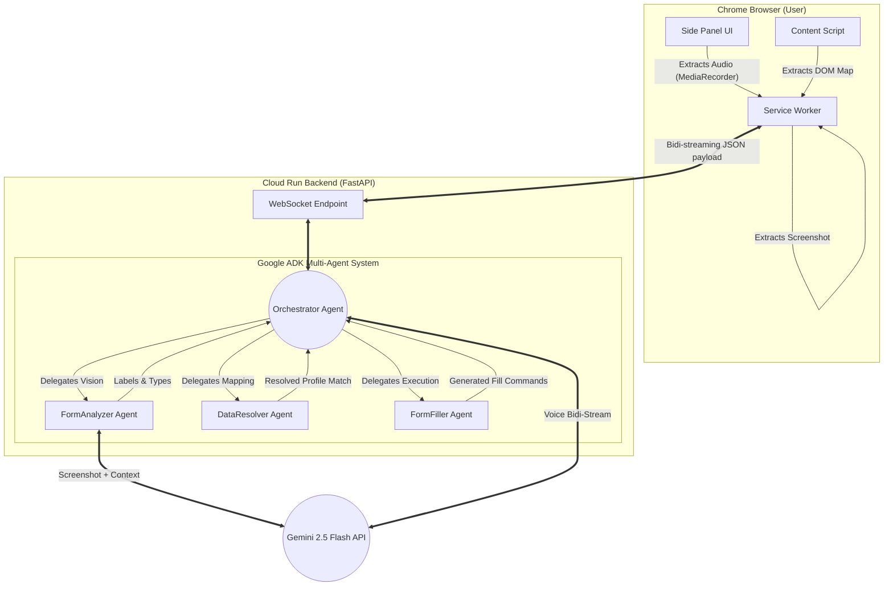

# FormPilot Architecture

FormPilot is designed explicitly to overcome the fragility of standard "DOM scraper" form fillers by augmenting them with a Semantic Vision Engine.

### Components:

1. **Side Panel**: Intercepts microphone events and displays visual UI updates.
2. **Service Worker**: Maintains a persistent WebSocket hook into Cloud Run.
3. **Orchestrator**: The root ADK Agent. It decides _which_ sub-agent should handle the incoming websocket payload.
4. **FormAnalyzer**: Receives the raw screenshot and the "dumb" DOM nodes. It calls Gemini Vision to generate "smart" human-readable labels, then links them.
5. **DataResolver**: Checks the user's stored profile (or triggers voice fallback if information is missing).
6. **FormFiller**: Generates the exact sequence of `dispatchEvent`, `.value` assignments, or `focus/click` commands that the Content Script needs to inject the data robustly.
